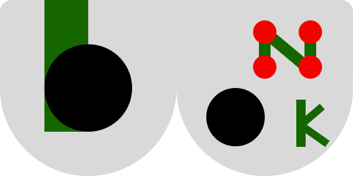

# Controle para Jogo - Megabonk

- Ideia do controle: ser um controle funcional e específico para jogar Megabonk, parecido com controles da atualidade como o Dualsense, mas completamente personalizado para o jogo.

## Inputs e Outputs (sensores e atuadores): 2 analógicos e 4 botões

## Protocolo utilizado: UART

## Diagrama de blocos explicativo do firmware:

## Imagens do controle

- Protótipo atual

## Links úteis
